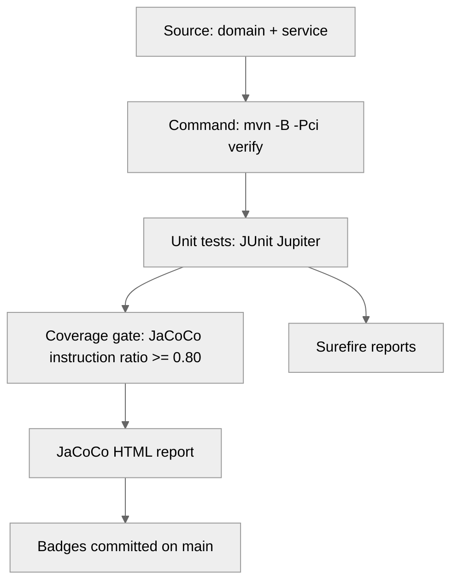

# CS-320: Verification-First Test Discipline

```yaml
STATUS  : ACTIVE
AUTHOR  : Bradley Saucier, SMSgt, USAF (Ret.)
COURSE  : SNHU CS-320 - Software Testing, Automation, and Quality Assurance
LICENSE : MIT
```

> [!IMPORTANT]
> **BOTTOM LINE UP FRONT**
> Build deterministic, in-memory services for Contact, Task, and Appointment records, then prove correctness with JUnit Jupiter and an auditable CI evidence trail.
>
> Mission success criteria:
> 1. All unit tests pass.
> 2. Coverage gate holds (JaCoCo instruction ratio >= 0.80).
> 3. Evidence artifacts are produced and reviewable (reports + badges).

<p align="left">
  <a href="https://github.com/bradsaucier/test-discipline/actions/workflows/maven-build.yml"></a>
  
  
</p>


> [!TIP]
> **GRADER FAST PATH**
> 1. Read: [Module 8 journal reflections](#7-module-8-journal-reflections)
> 2. Review: [Portfolio artifacts](#32-portfolio-artifacts)
> 3. Verify: `mvn -B -Pci verify` (tests + coverage gate)


---

## Table of contents

- [Situation and intent](#1-situation-and-intent)
- [Mission and constraints](#2-mission-and-constraints)
- [Execution](#3-execution)
  - [Mission dashboard](#31-mission-dashboard)
  - [Portfolio artifacts](#32-portfolio-artifacts)
  - [Verification outputs](#33-verification-outputs)
- [Administration and logistics](#4-administration-and-logistics)
  - [Repository layout](#41-repository-layout)
  - [Architecture](#42-architecture)
  - [Verification strategy](#43-verification-strategy)
  - [Traceability matrix](#44-traceability-matrix)
- [Command and signal](#5-command-and-signal)
  - [Evidence locker](#51-evidence-locker)
  - [Restrictions and threats](#52-restrictions-and-threats)
  - [Contingencies and rollback](#53-contingencies-and-rollback)
- [Academic integrity](#6-academic-integrity)
- [Module 8 journal reflections](#7-module-8-journal-reflections)
- [Notes](#8-notes)

---

## 1 Situation and intent

This repository is a CS-320 portfolio artifact demonstrating test discipline: requirements translated into unit tests, automated verification, and an auditable CI evidence trail.

Services are intentionally in-memory and deterministic. The objective is correctness under constraints, defensive input validation, and repeatable verification.

---

## 2 Mission and constraints

Mission: deliver unit-tested Java components and supporting portfolio evidence.

Constraints:

| ID | Constraint | Intent |
|---:|------------|--------|
| C0 | Java 17 toolchain | Build and tests target Java 17. The `release` flag prevents accidental API drift. |
| C1 | Unit test scope only | No database, no integration harness, no network dependencies. |
| C2 | Deterministic execution | Repeatable runs, low flake risk, predictable inputs and outputs. |
| C3 | Coverage gate in CI | Fail the build if JaCoCo instruction coverage drops below 0.80. |
| C4 | Volatile storage by design | In-memory only. Restart equals data loss. This is a constraint, not a defect. |

---

## 3 Execution

### 3.1 Mission dashboard

| Item | Detail |
|------|--------|
| Workflow | `Test Discipline` - job: `mission-assurance` |
| Triggers | push: `main`, `develop` - pull_request: `main`, `develop` |
| Paths ignored (push) | `**/*.md`, `docs/**`, `.github/badges/**` (pull_request still runs) |
| CI command | `mvn -B -Pci verify` |
| CI artifacts | `surefire-reports`, `jacoco-report` |
| Badge commit | `refs/heads/main` only, on success |
| Coverage gate | `ci` profile - `jacoco:check` at verify - instruction ratio >= 0.80 |

Note: `paths-ignore` is configured on push events to prevent badge feedback loops. Pull requests still run verification for visibility.


Module 8 portfolio artifact sets:

| Artifact set | Role | File |
|-------------|------|------|
| Project One | Domain | `src/main/java/Contact.java` |
| Project One | Service | `src/main/java/ContactService.java` |
| Project One | Tests | `src/test/java/ContactTest.java`, `src/test/java/ContactServiceTest.java` |
| Project Two | Report (PDF) | `docs/project-two/Project-Two-Summary-Reflections.pdf` |
| Project Two | GitHub mirror (MD) | `docs/project-two/README.md` |

### 3.2 Portfolio artifacts

This section is the Module 8 grading target set. Links are provided to reduce evaluator search time.

| Artifact | Purpose | Link |
|----------|---------|------|
| Contact.java | Project One domain model | [src/main/java/Contact.java](src/main/java/Contact.java) |
| ContactService.java | Project One service layer | [src/main/java/ContactService.java](src/main/java/ContactService.java) |
| ContactTest.java | Project One unit tests (domain) | [src/test/java/ContactTest.java](src/test/java/ContactTest.java) |
| ContactServiceTest.java | Project One unit tests (service) | [src/test/java/ContactServiceTest.java](src/test/java/ContactServiceTest.java) |
| Project Two report (PDF) | Summary and reflections | [docs/project-two/Project-Two-Summary-Reflections.pdf](docs/project-two/Project-Two-Summary-Reflections.pdf) |
| Project Two mirror (MD) | GitHub-readable summary | [docs/project-two/README.md](docs/project-two/README.md) |
| Project One brief (PDF) | Project One assignment brief (reference) | [docs/project-one/project_one_brief.pdf](docs/project-one/project_one_brief.pdf) |

Full component-to-file mapping across Modules 3-5: [Traceability matrix](#44-traceability-matrix).

### 3.3 Verification outputs

> [!NOTE]
> Paths under `target/` are generated locally. In CI, the workflow publishes `surefire-reports` and `jacoco-report` as run artifacts.


After a successful `mvn -B -Pci verify`:

| Artifact | Location |
|----------|----------|
| Surefire test reports | `target/surefire-reports/` |
| JaCoCo HTML report | `target/site/jacoco/index.html` |
| JaCoCo CSV (badge source) | `target/site/jacoco/jacoco.csv` |

Quick verification:

```bash
mvn -B test          # unit tests only
mvn -B -Pci verify   # tests + coverage gate (mirrors CI)
```

---

## 4 Administration and logistics

### 4.1 Repository layout

<details>
<summary>Repository tree (reference)</summary>

```text
.editorconfig
.gitattributes
.gitignore
.github/
  badges/
    .gitkeep
    branches.svg
    coverage-summary.json
    jacoco.svg
  dependabot.yml
  pull_request_template.md
  workflows/
    maven-build.yml
CONTRIBUTING.md
CITATION.cff
LICENSE
README.md
docs/
  journal/
    module-5-journal.md
  project-one/
    project_one_brief.pdf
  project-two/
    Project-Two-Summary-Reflections.pdf
    README.md
  requirements/
    README.md
    module-3-contact.md
    module-4-task.md
    module-5-appointment.md
  verification/
    ci-protocol.md
    security-posture.md
pom.xml
src/
  main/java/
    Appointment.java
    AppointmentService.java
    Contact.java
    ContactService.java
    Task.java
    TaskService.java
  test/java/
    AppointmentServiceTest.java
    AppointmentTest.java
    ContactServiceTest.java
    ContactTest.java
    TaskServiceTest.java
    TaskTest.java
```

</details>

### 4.2 Architecture

| Domain object | Service | Storage |
|---------------|---------|---------|
| Contact | ContactService | In-memory Map keyed by contactId |
| Task | TaskService | In-memory Map keyed by taskId |
| Appointment | AppointmentService | In-memory Map keyed by appointmentId |

Design choices:

| ID | Decision |
|---:|----------|
| D1 | Services use in-memory Maps keyed by ID for deterministic lookup and enforced uniqueness. |
| D2 | IDs are immutable (`final`) with no setter. |
| D3 | Appointment uses defensive copying of `java.util.Date` to prevent external mutation. |

### 4.3 Verification strategy

Rubric-derived test intent:

| ID | Intent |
|---:|--------|
| V1 | Boundary value coverage for constrained fields (max-valid, over-max). |
| V2 | Required field enforcement (null, empty). |
| V3 | Phone validation enforces exactly 10 digits (too-short, too-long, non-digit). |
| V4 | Appointment date validation rejects past dates using time offsets to reduce flake risk. |
| V5 | Service test isolation via `@BeforeEach` to prevent state bleed. |

Verification pipeline (evidence chain):



### 4.4 Traceability matrix


| Module | Requirement | Implementation | Tests |
|-------:|-------------|----------------|-------|
| M3 Contact | [module-3-contact](docs/requirements/module-3-contact.md) | [Contact](src/main/java/Contact.java), [ContactService](src/main/java/ContactService.java) | [ContactTest](src/test/java/ContactTest.java), [ContactServiceTest](src/test/java/ContactServiceTest.java) |
| M4 Task | [module-4-task](docs/requirements/module-4-task.md) | [Task](src/main/java/Task.java), [TaskService](src/main/java/TaskService.java) | [TaskTest](src/test/java/TaskTest.java), [TaskServiceTest](src/test/java/TaskServiceTest.java) |
| M5 Appt | [module-5-appointment](docs/requirements/module-5-appointment.md) | [Appointment](src/main/java/Appointment.java), [AppointmentService](src/main/java/AppointmentService.java) | [AppointmentTest](src/test/java/AppointmentTest.java), [AppointmentServiceTest](src/test/java/AppointmentServiceTest.java) |


All source files reside under `src/main/java/` and `src/test/java/`.

---

## 5 Command and signal

### 5.1 Evidence locker

<details>
<summary>All verification artifacts and their locations</summary>

| Evidence | Location |
|----------|----------|
| Citation metadata | `CITATION.cff` |
| Build workflow | `.github/workflows/maven-build.yml` |
| JaCoCo instruction badge | `.github/badges/jacoco.svg` |
| Branch coverage badge | `.github/badges/branches.svg` |
| Badge source data | `.github/badges/coverage-summary.json` |
| Requirements index | `docs/requirements/README.md` |
| CI protocol | `docs/verification/ci-protocol.md` |
| Security posture | `docs/verification/security-posture.md` |
| Project Two report (PDF) | `docs/project-two/Project-Two-Summary-Reflections.pdf` |
| Project Two mirror (MD) | `docs/project-two/README.md` |
| Journal entry | `docs/journal/module-5-journal.md` |
| Test reports (CI artifact) | workflow artifact: `surefire-reports` |
| Coverage report (CI artifact) | workflow artifact: `jacoco-report` |

</details>

### 5.2 Restrictions and threats

> [!WARNING]
> **FAILURE MODES**
> 1. Running without Java 17 can fail compilation or tests.
> 2. Skipping the `ci` profile bypasses the coverage gate used in CI.
> 3. In-memory storage is volatile. Restart equals data loss by design.

### 5.3 Contingencies and rollback

Condition: regression introduced (tests fail or coverage gate fails).

| Step | Action |
|------|--------|
| 1 | Re-run local verification: `mvn -B -Pci verify` |
| 2 | Identify failing tests in `target/surefire-reports/` |
| 3 | Review coverage deltas in `target/site/jacoco/index.html` |
| 4 | Roll back the last change set (revert commit or reset branch), then re-verify. |

---

## 6 Academic integrity

This repository contains coursework artifacts produced for SNHU CS-320 and repackaged for portfolio review. All work is my own.

If any portion is reused, cite the repository and distinguish original content from derived material.

Citation: [CITATION.cff](CITATION.cff) provides machine-readable metadata for GitHub "Cite this repository".

---

## 7 Module 8 journal reflections

<details>
<summary>1. How can I ensure that my code, program, or software is functional and secure?</summary>

I ensure functionality by translating requirements into executable assertions and then proving both success paths and failure paths. Domain objects fail fast at construction, and services enforce lifecycle rules (uniqueness, update, delete) so invalid state is rejected before it can propagate.

I treat security as disciplined boundary control and supply-chain hygiene. Inputs are validated at the edges, IDs remain immutable, and CI enforces repeatability by running `mvn -B -Pci verify` with a JaCoCo coverage gate. Dependencies and workflow actions are kept current through controlled updates, and workflow permissions are scoped to least privilege except where write access is required to commit badges.

</details>

<details>
<summary>2. How do I interpret user needs and incorporate them into a program?</summary>

I interpret user needs by converting natural-language requirements into specific constraints and observable behaviors. For CS-320, the rubric and module requirement documents are the specification.

I incorporate those needs through traceability: each constraint maps to named unit tests, and each test maps to the enforcing code. This creates a clean line of sight for a grader or reviewer from requirement to test to implementation, and it keeps scope controlled because only contract-driven behavior is built and verified.

</details>

<details>
<summary>3. How do I approach designing software?</summary>

I approach design verification-first. I define invariants first (what must always be true), encode them in the domain model, and keep the service layer deterministic by using in-memory Maps keyed by ID.

For this scale, I prioritize clarity over framework complexity. The result is modular code that is easy to test, easy to reason about, and auditable through repeatable CI runs and published verification artifacts.

</details>

---

## 8 Notes

1. This repository contains Contact, Task, and Appointment components to document end-to-end progression across Modules 3 to 5.
2. The official Project One portfolio artifact set for Module 8 is limited to the Contact files listed in the Mission dashboard.
3. Project Two is stored under `docs/project-two/` as a PDF plus a Markdown mirror for GitHub viewing.
4. In-memory storage is intentionally volatile for this course scope. In production, this service layer would sit in front of a persistence layer.
